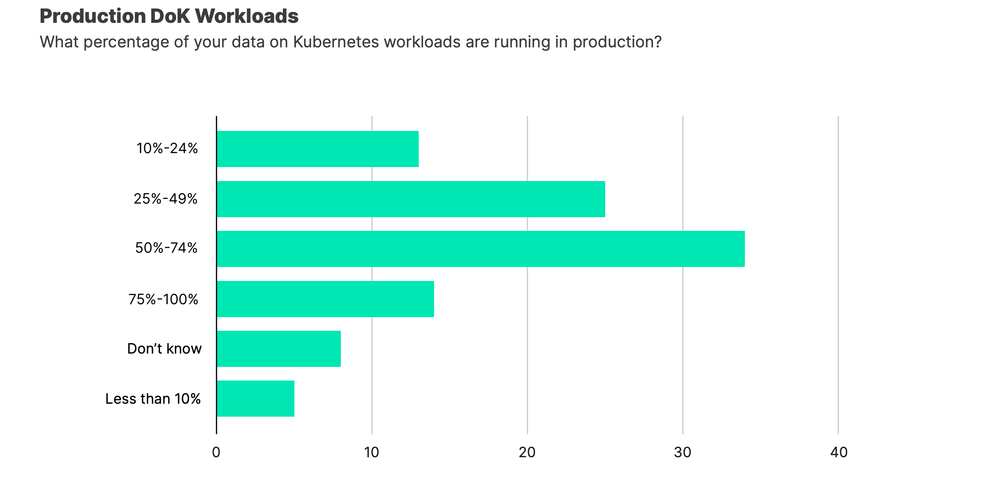
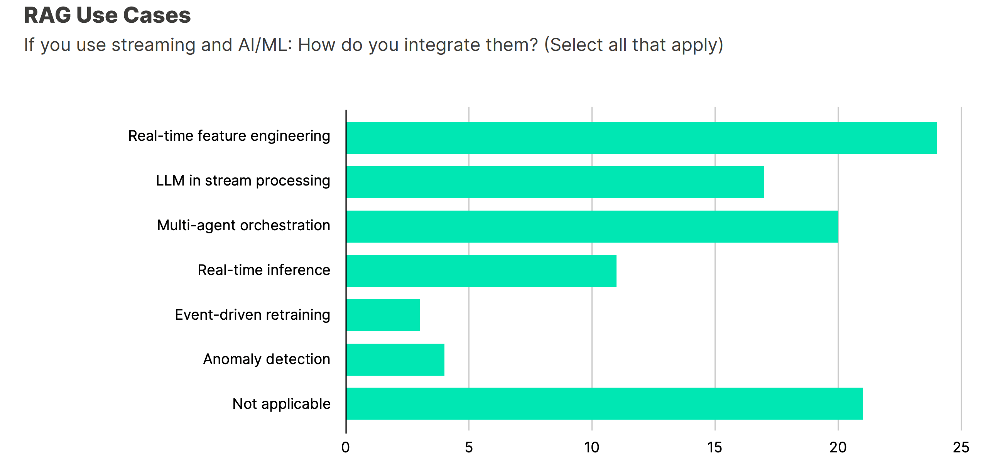

---
title: "Key Insights from the Data on Kubernetes 2025 Annual Report"
date: 2025-11-13T10:00:00Z
draft: false
image:
    url: dok-report-cover-min.png
    attribution: https://dok.community/blog/beyond-adoption-the-age-of-operational-excellence/ 
authors:
 - spron-in
tags:
 - blog
 - kubernetes
 - database
 - AI/ML
 - operational-excellence
summary: The 2025 Data on Kubernetes Annual Report confirms DoK has matured into standard practice. Learn about the shift toward operational excellence, cost optimization, and the rise of vector databases and edge computing.
---

The architectural debate is over: running data workloads on Kubernetes (**DoK**) is now **standard practice**. [The 2025 Data on Kubernetes Annual Report](https://dok.community/blog/beyond-adoption-the-age-of-operational-excellence/), "Beyond Adoption: The Age of Operational Excellence," confirms this maturity and outlines the new set of challenges and priorities for the community.

For organizations like ours, focused on providing robust database management solutions on Kubernetes, the report provides a clear roadmap for the next two years: the focus is no longer on *if* you should run data on Kubernetes, but **how to achieve operational excellence**.

---

## 📈 DoK Has Matured: Production is the Standard

The report clearly shows that DoK has crossed the chasm from experimentation to mission-critical infrastructure.

* **Production Dominance:** Nearly half of all organizations surveyed run **50% or more** of their DoK workloads in production.
* **Business Impact:** **62%** of organizations attribute **11% or more** of their revenue to running data on Kubernetes, demonstrating clear business value beyond engineering efficiency.

---

## 💾 Workload Foundation and Future

**Databases** remain the bedrock of Data on Kubernetes, securing the **#1 position (66%)** for the fourth consecutive year. This consistency validates Kubernetes' reliability for mission-critical, stateful data services.

However, the report highlights two key areas driving future architectural shifts:

### 1. The AI/ML Revolution

AI/ML workloads have surged to **44% adoption**, making it the **#3 workload type**. This adoption is driving significant infrastructure innovation, particularly with the emergence of **vector databases**.

* **Vector Databases as Critical Infrastructure:** An astonishing **77%** of respondents view vector databases as critical infrastructure, representing the strongest signal in the survey and the fastest adoption of any infrastructure component tracked. This is directly tied to the popularity of **Retrieval-Augmented Generation (RAG)** architectures for production AI applications.

### 2. The Edge + Real-time Architectural Shift

The community is moving decisively toward distributed, real-time architectures, a fundamental shift away from centralized, batch-oriented systems.

* **Real-time is Critical:** **64%** of organizations state that real-time data processing is essential for their AI strategy.
* **Edge Computing is Essential:** **61%** view edge computing as essential for their future data strategy. The primary drivers for this shift are **data privacy/sovereignty requirements** and **reduced latency for real-time applications**.

---

## 💰 The New Operational Imperatives: Cost and Performance

With adoption settled, the focus has shifted entirely to **operational excellence**. The new top concerns are efficiency-driven:

### 1. Cost Optimization Becomes the Top Priority

Optimizing costs has emerged as the **#1 priority for 2025**, surpassing AI/ML improvements and security.

* **Top AI/ML Cost Concern is Storage:** For organizations running AI/ML workloads, **storage costs (object storage, block storage)** are the #1 cost concern. This is driven by massive training datasets, growing model sizes, and the need for multiple model versions.
* **Top Strategies:** The most widely implemented cost strategies include **auto-scaling based on real-time demand (58%)** and **detailed resource tagging** for cost attribution.

### 2. Performance Gaps Reveal Opportunities

Despite maturity, performance bottlenecks persist, indicating a massive opportunity for optimization across the ecosystem.

* **#1 Bottleneck:** **Storage I/O performance** is cited as the biggest performance bottleneck (24%).
* **#2 Bottleneck:** **Model/data loading times** is the second biggest bottleneck (23%). Only **3%** of organizations achieve sub-1-minute model loading times, leading to significant GPU idle time and cost waste.

This validates the importance of advanced storage strategies. Organizations are deploying multiple strategies to combat this, including **in-memory caching (RAM discs)** and **local SSD caching layers**.

---

## 🛠️ Conclusion: The Path to Excellence

The 2025 Data on Kubernetes Report is a must-read, confirming that DoK is now the **foundation**, and **operational excellence is the differentiator**.

For platform providers like Everest, the message is clear: the market requires solutions that not only manage data on Kubernetes but help organizations **master performance optimization**, **manage surging storage costs**, and address the acute **skills gap (40% cite this as a top challenge)**. The next chapter of DoK will be defined by **efficiency and innovation**.

You can read the full report here: [Data on Kubernetes 2025 Annual Report](https://dok.community/blog/beyond-adoption-the-age-of-operational-excellence/)
